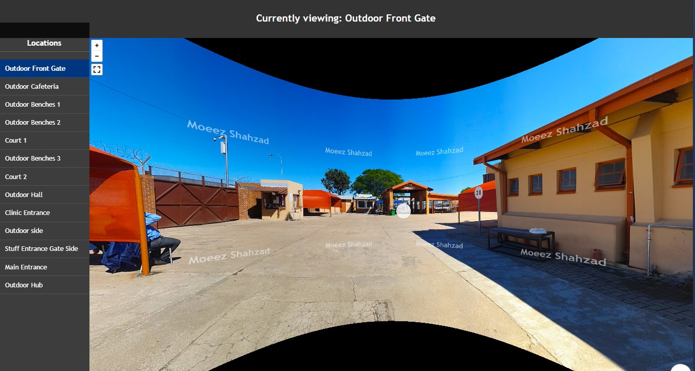
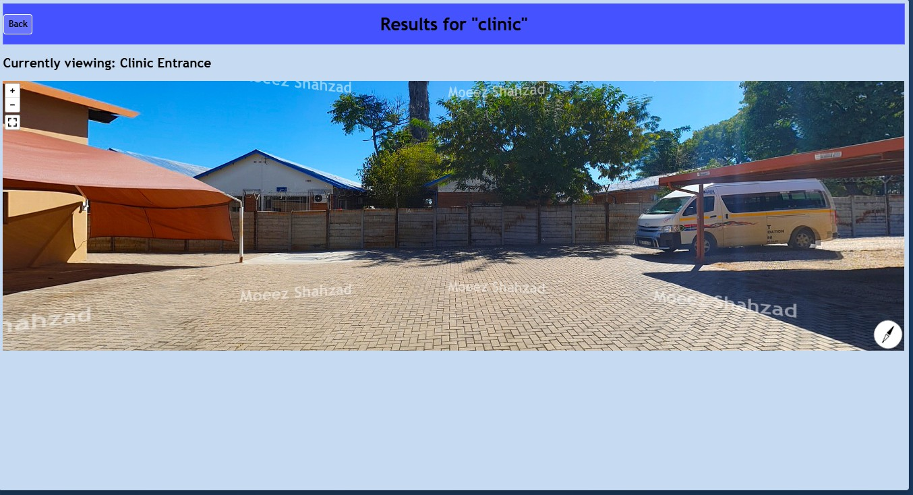

# 360-Campus-View

[](https://opensource.org/licenses/MIT)

An interactive, web-based 360° virtual campus tour application built using Java EE (Servlets, JSP), Enterprise JavaBeans (EJB), Apache Derby, and Pannellum JS. Features dynamic location rendering and a custom database-driven search system.

---

## 📷 Application Screenshots

Here is a quick look at the interface in action:

| 360° Interactive Viewer | Dynamic Location Search |
| --- | --- |
|  |  |

---

## ✨ Features

* **Interactive 360° Viewer:** Smooth, browser-based panorama rendering using WebGL (via Pannellum).
* **Smart Search Engine:** A live search system that uses SQL wildcard filtering to let users quickly look up and jump to landmarks (like "benches" or "court").
* **Dynamic Backend & Enterprise Architecture:** Utilizes custom Java Servlets and EJBs to serve standard JSP page views or raw JSON data depending on how the frontend requests it.

---

## 🛠️ Tech Stack & Requirements

* **IDE:** NetBeans 8.2
* **Java:** JDK 1.8 (Java SE 8)
* **Server:** GlassFish Server 4.1.1
* **Database:** Apache Derby (Java DB) via JDBC Driver (`derbyclient-10.14.2.0.jar`)

---

## 📂 Project Structure

* `src/java/.../controllers/` ── The servlet logic (`TourServlet`, `SearchLocationServlet`).
* `web/images/panoramas/outdoors/` ── Storage directory for your 360° `.jpg` photos.
* `web/viewer.jsp` & `searchView.jsp` ── The dynamic frontend user interfaces.
* `setup.sql` ── The database structural definition and data seeding script.
* `Dependences For this project/` ── Contains required external driver dependencies (e.g., Derby Client).

---

## 🔧 How to Make it Work (Step-by-Step)

Follow these steps to set up the project and get it running locally on your machine:

### 1. Clone the Project
```bash
git clone [https://github.com/YOUR_USERNAME/CampusTour360_Fixed.git](https://github.com/YOUR_USERNAME/CampusTour360_Fixed.git)
